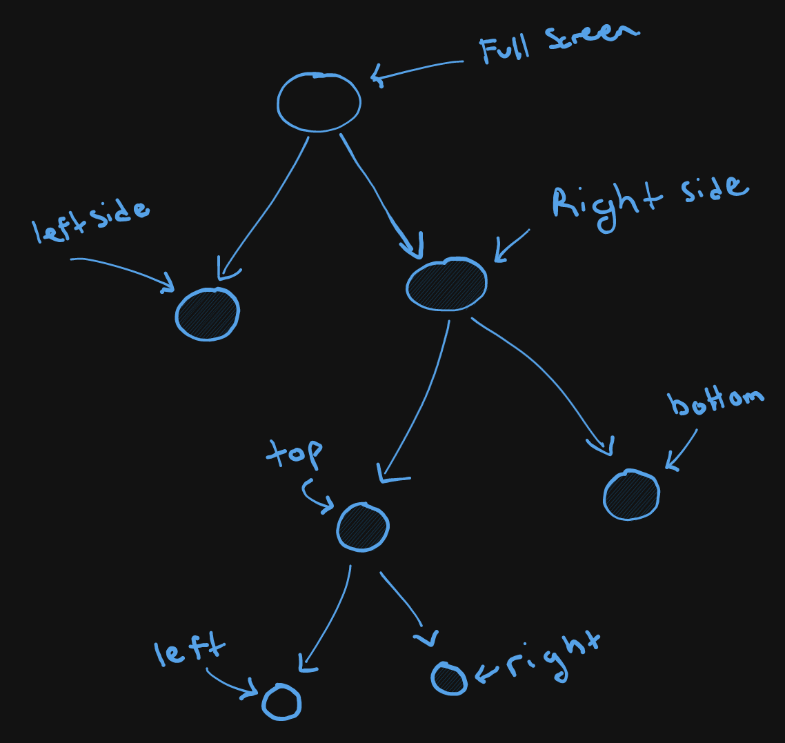

# Tiling Strategies

## Intro
There are normally two ways people like their windows managed when it comes to tiles, fixed positions or flex.
This application offers both strategies and people can switch between them statically.

## Fixed Positions:
This strategy is pretty simple, there are predefined "zones" on the screen which windows can be put into. The ones
offered would be:
- Left/Right Side
- 1/4 vertical screen starting from Left (continually movement pushing the window to the next 1/4 of the screen)
- 4 rectangle split: top left, top right, bottom left, bottom right (continually movement results in a clockwise rotation)
- Custom zones are not supported at the moment.

## Flex Tiling:
This strategy is a bit more complex. As windows are created, they will be tiled automatically and others will be adjusted
accordingly. Internally this is done using a modified but simple binary tree which visually looks like below. Operational
logic can be found in the code, feel free to take a look.

